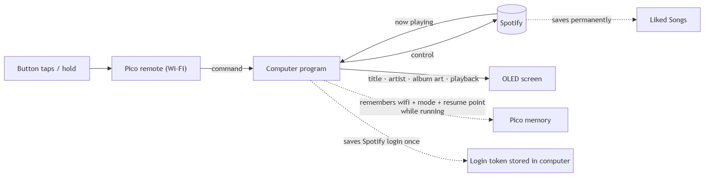

A tiny wireless remote for Spotify. When the button is pressed, a small computer program tells Spotify what to do and sends the current song back to the remote's little screen.

## Flow chart

## What you can do 

| Button press              | What happens                                                            |
| ------------------------- | ----------------------------------------------------------------------- |
| **Tap once**              | Play / Pause                                                            |
| **Tap twice**             | Next song                                                               |
| **Tap three times**       | Previous song — or restart the current one if it's been playing a while |
| **Tap four times**        | Toggle **Minimalist** (quiet focus) mode                                |
| **Tap five times**        | Toggle **Party** mode                                                   |
| **Tap six or more times** | **Find-a-song**: tap a rhythm and it plays a matching track             |
| **Press and hold**        | **Favourite** — saves the current song to your Liked Songs              |

The screen reacts to each tap (a face that smiles more the more you tap) so you know your taps were counted.  

## Modes & screens (states)

- **Default** — the normal now-playing screen: title, artist, album, progress bar, play/pause icon.

- **Minimalist** — clear feedback message, simpler UI without progress bar, shuffles and plays music from one of your study/focus playlists

- **Party** — wild feedback message, marching border and blinking screen that pulses in time with the song's beat, shuffle s and plays music from Spotify's public playlists Today's Top Hits, Just Hits, Party Hits 2010s

- **Find-a-song** — a tap-tempo screen that interprets the beat and plays a song matching your mood

- **Craving connection…** — Pico cannot connect to your computer when powered up because of invalid WiFi or errors in computer program

- **Feed me music!** — Pico cannot detect Spotify is playing any music

- **Snoozing** — Detects computer is sleeping; the screen shows "snoozinggg" and then turns off

- **Feedback message** — a short playful phrase after an action (e.g. "changin' it up!").

Only one special mode is active at a time. Leaving a mode returns you to what you were playing before it started.

## What is remembered

**Remembered (survives a restart):**

- Your Spotify login — saved on the bridge as a token, so you only sign in once

- Your Favourites — saved to your Spotify account, permanently

- Your Wi-Fi name/password and the computer's address — saved on the Pico itself

- Everything about playback (the song, position, playlists) lives in Spotify, not in Pico

**Remembered only while the bridge is running (lost on restart):**

- The current mode (Default / Minimalist / Party)

- The "resume point" used to return you to the previous playlist and song

- Cached song tempo for party mode and album art for find-a-song mode, and the latest now-playing snapshot

**Not remembered at all:**

- Nothing is stored on the Pico itself. Unplug it and its screen state, current song, and mode are gone — it rebuilds them from the computer program once reconnected

